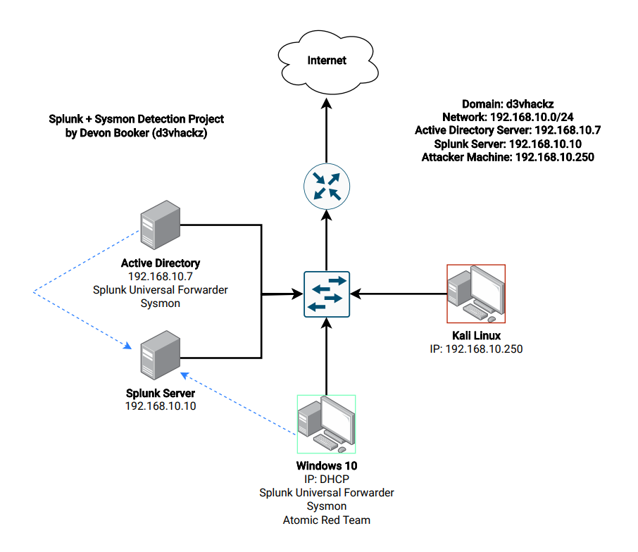

# My Splunk + Sysmon SIEM Detection Lab

This repository contains all the configurations and documentation for a personal SIEM lab I built to practice threat detection and analysis. It uses a combination of Splunk Enterprise and Microsoft Sysmon to provide deep visibility into endpoint activity, creating a powerful environment for hunting simulated threats.

This project is documented to serve as a blueprint for anyone looking to build a similar hands-on security lab.

  

## Project Goals

*   **Hands-On Learning:** To gain practical experience in configuring and managing SIEM tools, endpoint sensors, and log forwarders.
*   **Detection Engineering:** To research common attacker techniques and build high-fidelity detection rules to spot them.
*   **Showcase of Skills:** To document and demonstrate practical skills in security monitoring, data analysis, and threat hunting.

## ✨ Features

*   **Splunk Enterprise** as the central SIEM platform.
*   **Microsoft Sysmon** for granular endpoint logging on a Windows VM.
*   **Community-Driven Sysmon Configuration** from [SwiftOnSecurity](https://github.com/SwiftOnSecurity/sysmon-config) for excellent baseline visibility.
*   **Ready-to-Use Config Files** for the Splunk Universal Forwarder (`inputs.conf`).
*   **Example Detection Queries** for spotting suspicious activity like obfuscated PowerShell, malware drops, and more.

---

## 🚀 Getting Started

I have written a complete, step-by-step guide that walks through the entire lab setup process, from installing the VMs to writing the detection rules.

### **[➡️ View the Full Step-by-Step Tutorial](./docs/TUTORIAL.md)**

---

## 🎯 Example Detections

Here is a quick look at the kinds of threats this lab can detect. The full tutorial details how to simulate and catch these.

| Threat Scenario                       | Splunk Detection Query                                                                                                      |
| ------------------------------------- | --------------------------------------------------------------------------------------------------------------------------- |
| **Obfuscated PowerShell Execution**   | `index=sysmon EventCode=1 Image="*\\powershell.exe" (CommandLine="*-enc*" OR CommandLine="*-EncodedCommand*")`                  |
| **Executable Dropped in Temp Folder** | `index=sysmon EventCode=11 TargetFilename IN ("C:\\Windows\\Temp\\*.exe", "C:\\Users\\*\\AppData\\Local\\Temp\\*.exe")`      |
| **Suspicious Network Connection**     | `index=sysmon EventCode=3 \| where Image NOT IN ("*\\chrome.exe", "*\\firefox.exe", "*\\msedge.exe")`                           |

## 📁 Repository Contents

*   **/docs/**: Contains the full step-by-step tutorial and all image assets.
*   **/configs/**: Contains the configuration files needed for the Splunk Universal Forwarder.
*   `README.md`: This file, providing a high-level overview of the project.