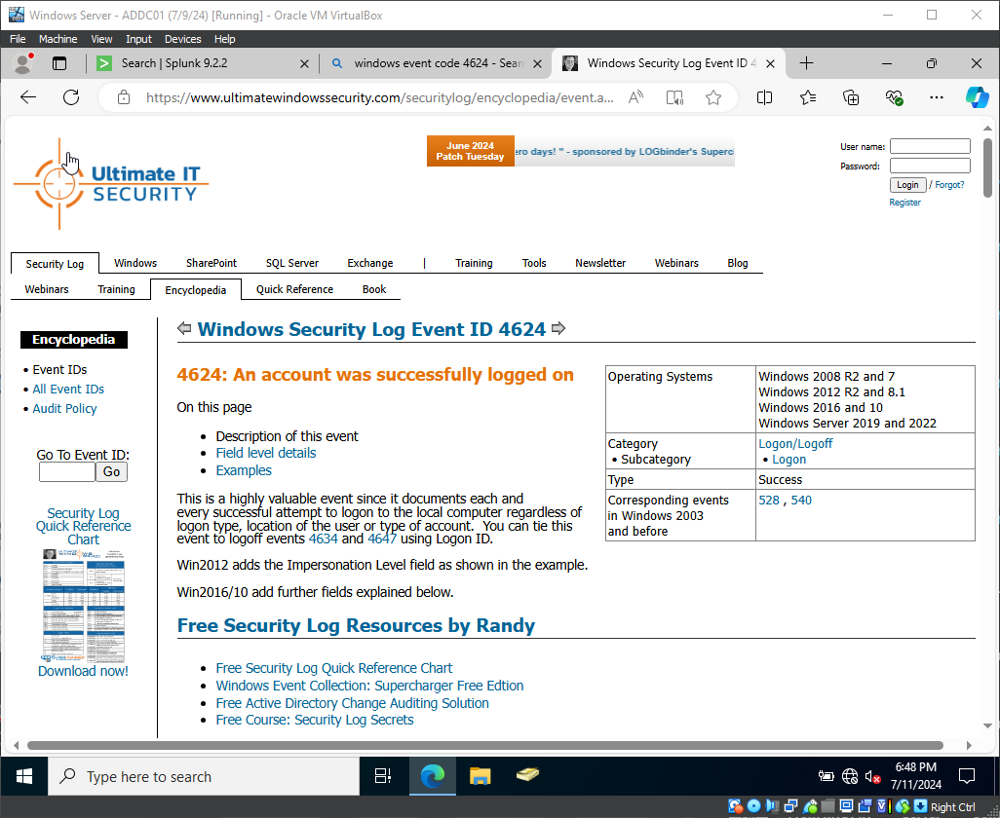

# My Splunk + Active Directory Detection Lab: Full Illustrated Guide

This document details the complete process I followed to build my advanced SIEM detection lab. This project goes beyond a simple setup and integrates a full Microsoft Active Directory environment, enabling realistic attack simulation and detection scenarios.

## Table of Contents
1.  [Lab Architecture & Components](#-lab-architecture--components)
2.  [Part 1: The Foundation - Virtual Environment Setup](#part-1-the-foundation---virtual-environment-setup)
3.  [Part 2: The Domain - Building the Active Directory Environment](#part-2-the-domain---building-the-active-directory-environment)
4.  [Part 3: The SIEM - Splunk & Endpoint Configuration](#part-3-the-siem---splunk--endpoint-configuration)
5.  [Part 4: The Arsenal - Attacker & Testing Frameworks](#part-4-the-arsenal---attacker--testing-frameworks)
6.  [Part 5: The Hunt - Attack Simulation & Detection](#part-5-the-hunt---attack-simulation--detection)

---

## 📝 Lab Architecture & Components

My lab consists of four virtual machines operating within a private NAT network, creating an isolated but realistic enterprise environment.

  

*   **Windows Server 2022 (ADDC01):** The Domain Controller, serving `d3vhackz.local`.
*   **Ubuntu Server (Splunk Server):** Hosts the Splunk Enterprise instance for log collection and analysis.
*   **Windows 10 (Target Machine):** A domain-joined workstation where attacks are simulated. It runs Sysmon and the Splunk Forwarder.
*   **Kali Linux (Attacker Machine):** Used to launch attacks against the environment.

---

## Part 1: The Foundation - Virtual Environment Setup

### 1.1 VirtualBox Network Configuration
I started by creating a dedicated NAT Network in VirtualBox named `Splunk/Sysmon-Project`. This ensures all my VMs can communicate with each other on the `192.168.10.0/24` subnet.

  

With the network in place, I created the four virtual machines required for the lab.

  
   
  <em>My final set of virtual machines in Oracle VirtualBox.</em>

---

## Part 2: The Domain - Building the Active Directory Environment

### 2.1 Setting up the Domain Controller (ADDC01)
1.  **Install Active Directory Domain Services (AD DS):** On the Windows Server VM, I used Server Manager to add the "Active Directory Domain Services" role.

    

      
    

2.  **Promote to Domain Controller:** After the role installation, I promoted the server to a new domain controller.

    

      
    

3.  **Create a New Forest:** I created a new forest and set the root domain name to `d3vhackz.local`.

    

      
    

4.  **Create Users:** Using "Active Directory Users and Computers," I populated the domain with several user accounts to simulate a real environment.

    

      
    

### 2.2 Joining the Windows 10 Endpoint to the Domain
I joined the Windows 10 "Target Machine" to the `d3vhackz.local` domain, making it a managed endpoint in my new environment.

  

---

## Part 3: The SIEM - Splunk & Endpoint Configuration

### 3.1 Splunk Server Configuration
*   I accessed the Splunk web interface at `http://192.168.10.10:8000`.
*   I configured the receiving port by navigating to **Settings > Forwarding and receiving** and enabling port **9997**.
*   I created a new index named `endpoint` via **Settings > Indexes** to store all logs from my workstations and servers.

  

### 3.2 Windows Endpoint Configuration (ADDC01 & Target-PC)
I performed these steps on both the Domain Controller and the Windows 10 machine.

1.  **Install Sysmon:** I downloaded Sysmon from Sysinternals and used a community configuration to ensure rich event logging. I then installed it via an administrative PowerShell.

    

      
    

2.  **Install Splunk Universal Forwarder:** I installed the forwarder on each Windows machine, pointing it to my Splunk Server's IP (`192.168.10.10`) during setup.

    

      
    

3.  **Configure `inputs.conf`:** I created an `inputs.conf` file in `C:\Program Files\SplunkUniversalForwarder\etc\system\local` to forward Sysmon events and the critical Windows Security and Application event logs.

    

      
    

---

## Part 4: The Arsenal - Attacker & Testing Frameworks

### 4.1 Kali Linux Setup
On the Kali VM, I installed `crowbar`, a brute-force tool that can be used for RDP attacks.

  

### 4.2 Atomic Red Team Setup
On the Windows 10 endpoint, I installed the **Atomic Red Team** framework to safely execute simulations of known adversary TTPs.

1.  **Installation:** I used the PowerShell execution command to download and install the framework.

    

      
    

2.  **Microsoft Defender Exclusion:** To ensure the test payloads could run without being blocked, I added an exclusion for the `C:\` folder in Microsoft Defender for the purpose of this lab.

    

      
    

---

## Part 5: The Hunt - Attack Simulation & Detection

This is where the lab comes to life. I executed controlled attacks and then pivoted to Splunk to find the evidence.

### Scenario 1: Create Account (T1136.001) with Atomic Red Team

1.  **Execution:** I used Atomic Red Team to simulate an attacker creating a new local user account named `NewLocalUser`, which maps to the MITRE ATT&CK technique T1136.

    

      
       
      <em>Executing the test for T1136.001 - Create Account: Local Account.</em>
    

    

      
    

2.  **Detection:** I immediately searched in Splunk for the Windows Security Event ID `4720`, which indicates "A user account was created." The event was found instantly, showing the `NewLocalUser` account name and linking back to the process that created it.

    

      
       
      <em>The search `index=endpoint NewLocalUser EventCode=4720` successfully identified the malicious activity.</em>
    

### Scenario 2: RDP Brute-Force Attack from Kali Linux

1.  **Execution:** From my Kali machine, I used `crowbar` to launch an RDP brute-force attack against the Windows 10 machine's IP, using a simple password list. The tool successfully found the password for the user `mcox`.

    

      
    

2.  **Detection:** A high volume of failed logins is a strong indicator of a brute-force attack. 
    *   First, looking in the Windows Event Viewer on the target machine shows a flood of **Event ID 4625 (An account failed to log on)**.
    *   Pivoting to Splunk, a simple search for this event ID reveals the storm of failed attempts originating from the Kali machine's IP address.

    

      
       
      <em>The local Event Viewer shows clear evidence of the attack.</em>
    

    

      
       
      <em>Filtering on Event ID 4625 in Splunk reveals the brute-force attempt from the Kali workstation.</em>
    

This walkthrough demonstrates an end-to-end detection engineering process: building the environment, instrumenting the endpoints, simulating attacks, and using the SIEM to detect and analyze the malicious activity.