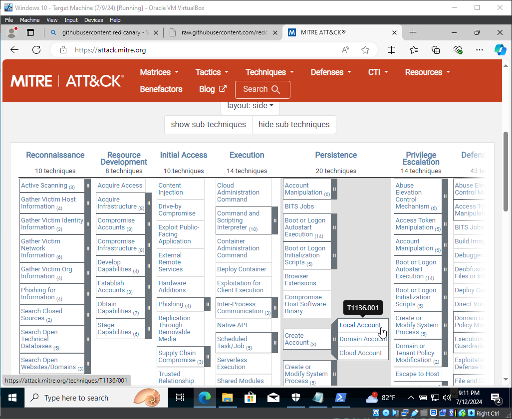
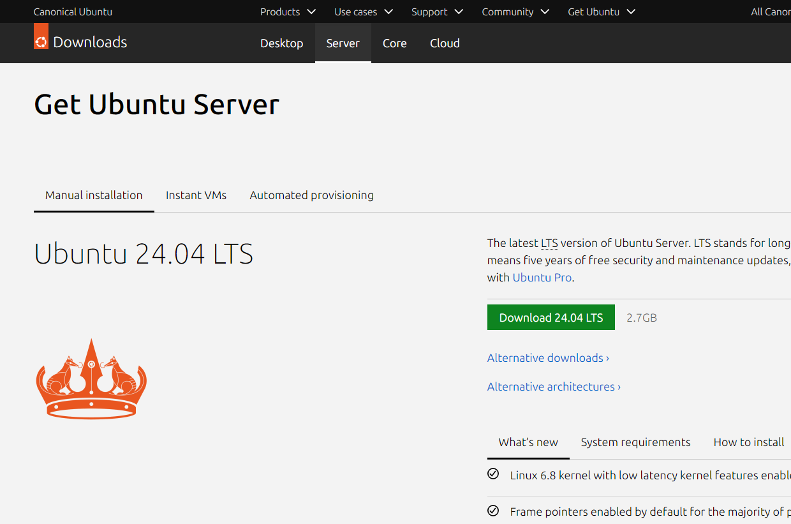
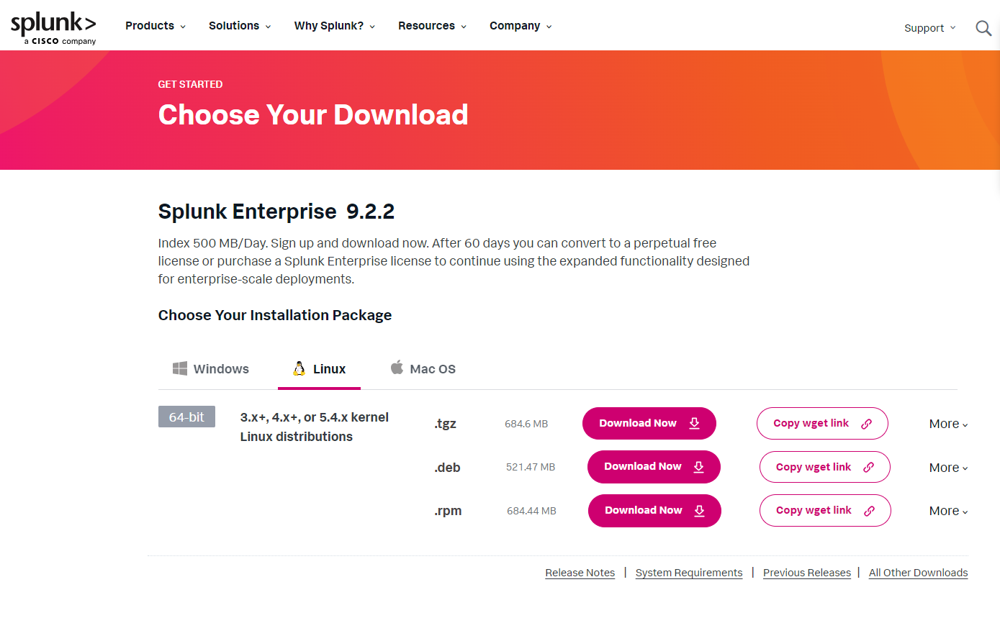
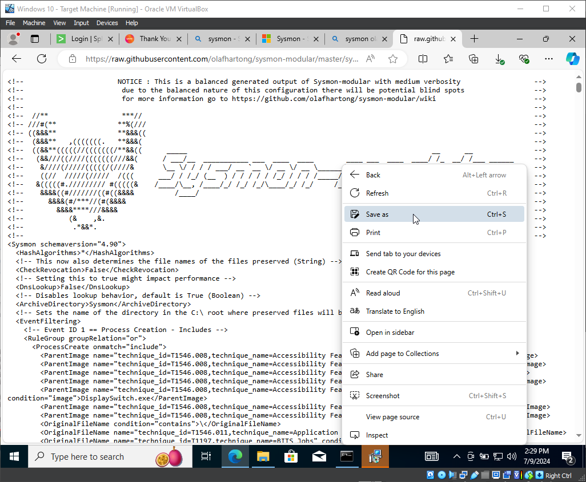
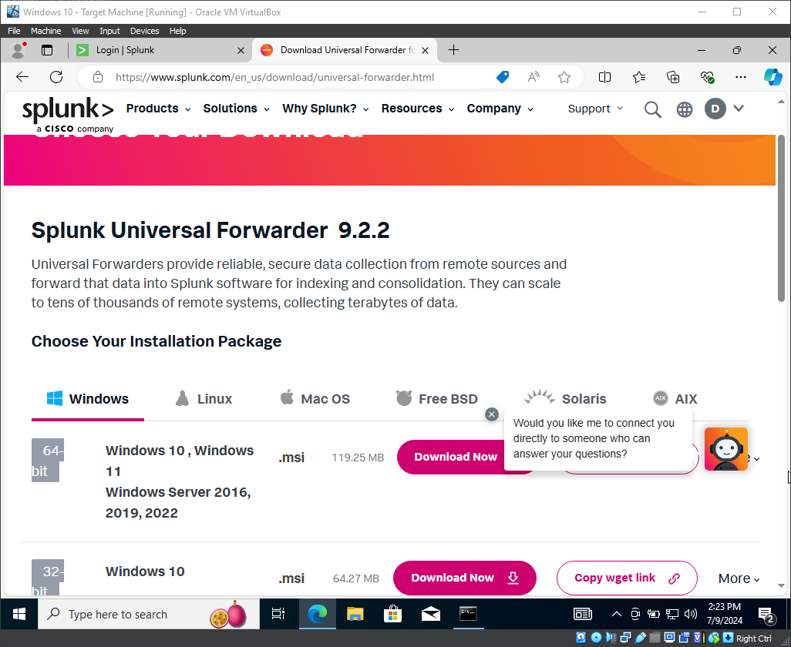
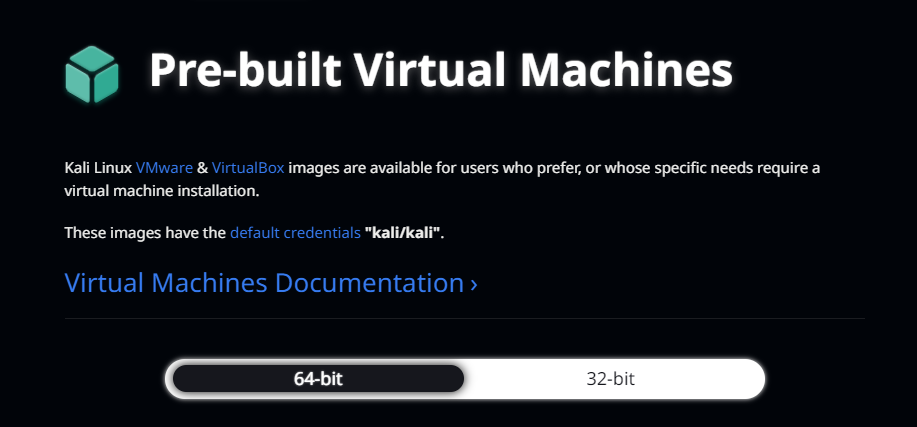

# My Splunk + Sysmon SIEM Lab: Illustrated Step-by-Step Guide

This document details the complete process I followed to build my SIEM detection lab, with screenshots of the key components I used.

## Table of Contents
1.  [Lab Components](#-lab-components-and-architecture)
2.  [Step 1: Configure the SIEM Server](#step-1-configuring-the-siem-server)
3.  [Step 2: Configure the Windows Endpoint](#step-2-configuring-the-windows-endpoint)
4.  [Step 3: Set up the Attacker Machine (Optional)](#step-3-setting-up-the-attacker-machine-optional)
5.  [Detection & Analysis Examples](#-detection--analysis-examples)
6.  [References](#-references)

---

## 📝 Lab Components and Architecture

My lab setup consists of several virtual machines working together. At a high level, logs from a Windows "victim" machine are sent to a Splunk server for analysis. I then use a Kali Linux machine to generate activity to detect.

<p align="center">
  
  <br>
  <em>The goal is to detect techniques mapped to a framework like MITRE ATT&CK.</em>
</p>

---

## Step 1: Configuring the SIEM Server

For my SIEM, I chose to run Splunk Enterprise on a lightweight Ubuntu Server VM.

<p align="center">
  
  <br>
  <em>I used the Ubuntu Server (CLI) for a minimal footprint.</em>
</p>

1.  **Install Splunk Enterprise**: After setting up the Ubuntu Server, I downloaded and installed Splunk Enterprise from the [official website](https://www.splunk.com/en_us/download/splunk-enterprise.html).

    <p align="center">
      
      <br>
      <em>I selected the Linux (.tgz) package for my installation.</em>
    </p>

2.  **Enable Receiving Port**: In the Splunk Web UI, I navigated to **Settings > Forwarding and Receiving > Receive data** and enabled port `9997`.

3.  **Create a Dedicated Index**: To keep my Sysmon data separate, I went to **Settings > Indexes > New Index** and created an index named `sysmon`.

---

## Step 2: Configuring the Windows Endpoint

This is the "victim" machine that will generate the logs. I used a standard Windows 10 VM.

1.  **Download and Install Sysmon**: I obtained the Sysmon tool from the official [Microsoft Sysinternals page](https://learn.microsoft.com/en-us/sysinternals/downloads/sysmon).

    <p align="center">
      
      <br>
      <em>Sysmon is a powerful tool for endpoint visibility.</em>
    </p>

2.  **Obtain a Sysmon Configuration File**: I used the popular [SwiftOnSecurity Sysmon Config](https://github.com/SwiftOnSecurity/sysmon-config) to get a comprehensive set of rules.

    <p align="center">
      
      <br>
      <em>An example snippet of the XML configuration that defines what Sysmon logs.</em>
    </p>

3.  **Install Sysmon**: In an Administrator PowerShell, I ran `.\Sysmon64.exe -accepteula -i sysmonconfig-export.xml` to install the service with my chosen configuration.

4.  **Install the Splunk Forwarder**: To send logs to my Splunk server, I installed the [Splunk Universal Forwarder](https://www.splunk.com/en_us/download/universal-forwarder.html).

    <p align="center">
      
      <br>
      <em>I used the Windows 64-bit installer (.msi).</em>
    </p>

5.  **Configure Log Collection**: I created an `inputs.conf` file in `C:\Program Files\SplunkUniversalForwarder\etc\system\local\` to tell the forwarder to collect the Sysmon logs. The contents of this file are available in the `/configs` directory of this repository.

6.  **Install the Splunk Add-on**: On my Splunk Server, I installed the **Splunk Add-on for Microsoft Sysmon** from Splunkbase. This add-on correctly parses the XML logs into usable fields.

---

## Step 3: Setting Up the Attacker Machine (Optional)

To simulate threats, I set up a Kali Linux VM. This allows me to safely generate network traffic and execute payloads against my Windows endpoint.

<p align="center">
  
  <br>
  <em>I used a pre-built Kali Linux image for virtualization software.</em>
</p>

---

## 🎯 Detection & Analysis Examples

With the lab fully configured, I was able to simulate attacker activity from the Kali machine (or directly on the Windows VM) and detect it in Splunk.

### Example 1: Detecting Obfuscated PowerShell

*   **Simulation (on Windows VM)**:
    ```powershell
    powershell.exe -EncodedCommand "dABoAG8AYQBtAGkA"
    ```
*   **Detection (in Splunk)**:
    ```spl
    index=sysmon EventCode=1 Image="*\\powershell.exe" (CommandLine="*-enc*" OR CommandLine="*-EncodedCommand*")
    ```

### Example 2: Detecting Executables Dropped in Temp Folders

*   **Simulation (on Windows VM)**:
    ```powershell
    New-Item -Path C:\Windows\Temp\malware.exe -ItemType File
    ```
*   **Detection (in Splunk)**:
    ```spl
    index=sysmon EventCode=11 TargetFilename IN ("C:\\Windows\\Temp\\*.exe", "C:\\Users\\*\\AppData\\Local\\Temp\\*.exe")
    ```
---

## 📚 References

1.  **Sysmon config & threat hunting w/ Splunk SIEM** | by Fsantos | Medium - [https://medium.com/@fsantos094tmc/sysmon-config-threat-hunting-w-splunk-siem-fc650b2a658f](https://medium.com/@fsantos094tmc/sysmon-config-threat-hunting-w-splunk-siem-fc650b2a658f)
2.  **Peeping Through Windows (Logs): Using Sysmon & Event Codes for Threat Hunting** | Splunk - [https://www.splunk.com/en_us/blog/security/threat-hunting-sysmon-event-codes.html](https://www.splunk.com/en_us/blog/security/threat-hunting-sysmon-event-codes.html)
3.  **Sysmon Event ID 1 - Process creation** - Ultimate Windows Security - [https://www.ultimatewindowssecurity.com/securitylog/encyclopedia/event.aspx?eventid=90001](https://www.ultimatewindowssecurity.com/securitylog/encyclopedia/event.aspx?eventid=90001)
4.  **[CyberSec] Sysmon On-Demand for Enhanced Visibility During Incident Investigation** | by Pietro Romano / SecBeret - [https://medium.com/@tribal.secberet/sysmon-on-demand-for-enhanced-visibility-during-incident-investigation-1c398ca5033b](https://medium.com/@tribal.secberet/sysmon-on-demand-for-enhanced-visibility-during-incident-investigation-1c398ca5033b)
5.  **Sysmon - Sysinternals** | Microsoft Learn - [https://learn.microsoft.com/en-us/sysinternals/downloads/sysmon](https://learn.microsoft.com/en-us/sysinternals/downloads/sysmon)